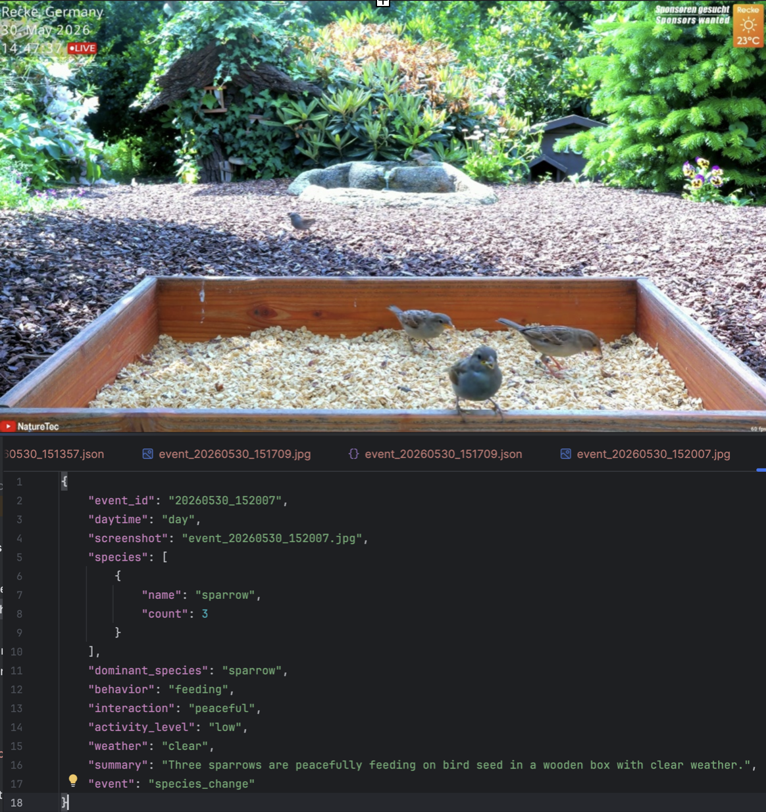
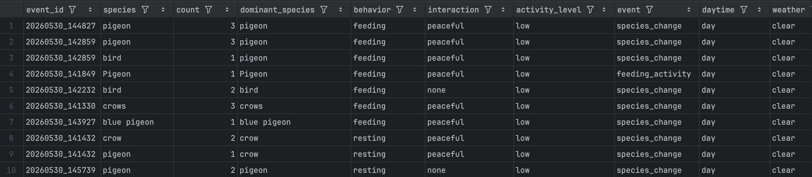

# Semantic Wildlife Monitoring from Public Livestreams

An AI-powered wildlife monitoring system that automatically transforms raw livestreams into structured ecological observations.

This project combines object detection, Vision-Language Models (VLMs), and Large Language Models (LLMs) to identify animal species, estimate their numbers, describe behavior and interactions, and generate machine-readable datasets for further analysis.

---

## Applications

The generated observations can support:

* Wildlife monitoring
* Species diversity assessment
* Behavioral analysis
* Animal activity tracking
* Ecological research
* Animal welfare monitoring

Potential use cases include:

* Nature reserves
* Zoos
* Wildlife rehabilitation centers
* Veterinary clinics

Because semantic analysis is controlled through prompts, the same architecture can be adapted to many other livestream monitoring tasks.

---

## Features

* Real-time livestream processing
* Event-driven frame extraction
* Wildlife detection using YOLOv8
* Semantic scene analysis using Qwen2-VL
* Structured JSON event generation
* CSV dataset creation
* OCR extraction of livestream metadata
* Automatic behavior and interaction analysis
* Basic ecological analytics

---

## System Pipeline

```text
Livestream
    ↓
YOLO Detection
    ↓
Frame Extraction
    ↓
VLM Semantic Analysis
    ↓
LLM Structuring
    ↓
JSON Events
    ↓
CSV Dataset
    ↓
Analytics
```

---

## Example Observation



---

## Data Collection

Each extracted frame and its corresponding JSON observation share the same timestamp-based identifier.

Example:

```text
event_20260530_151357.jpg
event_20260530_151357.json
```

This ensures full traceability between source images and generated semantic observations while preserving the temporal context of the livestream.

---

## Dataset

The collected observations are converted into a CSV dataset.

Each row represents a single species observation together with semantic and environmental information such as:

* Species
* Count
* Behavior
* Interaction type
* Activity level
* Weather conditions
* Daytime

Example:



---

## Demo Video

A short project demonstration is available here:

[Demo Video](https://youtu.be/x2J2IYK3u1w)

---

## Tech Stack

* Python
* OpenCV
* YOLOv8
* VLM (Qwen2_VL-2B-Instruct)
* LLM (qwen2.5:14b)
* Ollama
* Pandas
* Pytesseract
* FFmpeg
* yt-dlp

---

## Run

Install dependencies:

```bash
pip install -r requirements.txt
```

Start livestream collection:

```bash
python src/collect_live_data.py
```

Run semantic analysis:

```bash
python src/analyze_events.py
```

Create CSV dataset

```bash
python src/export_data_csv.py
```
